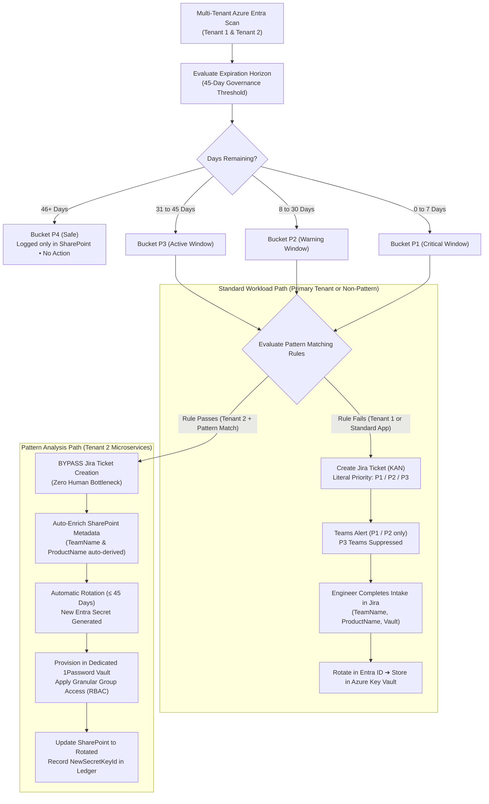

import { Callout } from 'nextra/components'

# Pattern Analysis & 1Password Governance (Latest Architecture)

This section contains the **latest production code** for Azure Secret Governance with **Dynamic Pattern Analysis** and **1Password Vault Isolation**.

While the baseline code routes every single expiring secret through Jira tickets and manual human intake, this architecture introduces intelligent workload classification: **standard enterprise apps follow the formal Jira approval process**, while **high-frequency automated services in the secondary tenant bypass Jira tickets and sync directly into 1Password vaults**.

---

## Architecture: Standard vs. Pattern Workloads



---

## The Two Strict Rules of Pattern Analysis

To protect enterprise compliance, Jira ticket creation is **never** bypassed indiscriminately. A secret candidate must satisfy **BOTH** of the following conditions:

```python
def should_bypass_jira_for_secret(c: dict) -> bool:
    env_tenants = os.environ.get("BYPASS_JIRA_TENANT_IDS")
    if not env_tenants:
        return False
    allowed_tenants = [t.strip().lower() for t in env_tenants.split(",") if t.strip()]
    if not allowed_tenants:
        return False

    tenant_id = (c.get("tenant_id") or c.get("TenantID") or "").strip().lower()
    if tenant_id not in allowed_tenants:
        return False

    desc = c.get("secret_desc") or c.get("SecretDescription") or ""
    return matches_bypass_jira_pattern(desc)
```

### Rule 1: Strict Tenant 2 Isolation
* **Condition:** The secret **MUST** originate from Tenant 2 (`c721d616-dcf3-4510-9c3e-548bc6c1f628`).
* **Protection:** Secrets belonging to the Primary Tenant (`70afdd80-5f5b-4a09-a90d-383f126e8c33`) are **NEVER bypassed**, regardless of their name. They always follow the standard human-governed Jira ticket flow.

### Rule 2: Display Name Pattern Matching
* **Condition:** The Entra credential `displayName` or description must match one of the configured naming patterns:
  * `*.select*` (e.g. `reporting.select.appkey`)
  * `practice-plus-*` (e.g. `practice-plus-worker-cert`)
  * `*partner*` (e.g. `crm-partner-auth-token`)

---

## 45-Day Governance Threshold

Both the Decision Engine and the Rotation Engine operate on the **45-day threshold** model:

| Horizon (Days Remaining) | Bucket | Jira Ticket (Standard) | Jira Ticket (Pattern App) | Teams Notification (Standard) | Teams Notification (Pattern App) |
| :--- | :---: | :---: | :---: | :---: | :---: |
| **46+ Days** | **P4** | Logged Only (Safe) | Logged Only (Safe) | None | None |
| **31 – 45 Days** | **P3** | Created (`Priority: P3`) | **BYPASSED** | Suppressed | **BYPASSED** |
| **8 – 30 Days** | **P2** | Created (`Priority: P2`) | **BYPASSED** | Warning Card Sent | **BYPASSED** |
| **0 – 7 Days** | **P1** | Created (`Priority: P1`) | **BYPASSED** | Critical Card (@mention for 0-3d) | **BYPASSED** |
| **Past Expiry (-1 to -7d)** | **Expired** | Created (`Priority: P1`) | Logged for Manual Review | Critical Alert | Manual Review |

---

## 1Password Vault Isolation & Group Access

For pattern-matched applications, rotation does not stop at Azure Key Vault. It integrates directly with 1Password:

1. **Vault Scoping:** The rotator dynamically locates or provisions a dedicated team vault:
   ```
   Vault Name: <AppName>-Vault  (or  <ProductName>-Secrets)
   ```
2. **Item Provisioning:** Generates a new secret version in Entra ID, stores the client secret credentials as a secure item inside the target vault, and creates a time-limited 1Password secure share link.
3. **Group Access Isolation:** Automatically binds the vault to designated 1Password / Entra ID user groups (e.g. `Developers-Group`, `DevSecOps-Engineers`), ensuring team members have immediate access without manual ticket handling.
4. **SharePoint Record:** Stamps `RotationDetectedDate`, `NewSecretKeyId`, and marks `AlertStatus = RotatedPendingDeployment` / `Rotated`.

---

## Files in this Section

* [`decision_engine.py`](/azure-secret-governance/pattern-analysis/decision-engine): Full Decision Engine code with multi-tenant scanning, 45-day buckets, pattern analysis, and auto-enrichment.
* [`secret_rotation_engine.py`](/azure-secret-governance/pattern-analysis/rotation-engine): Rotation Engine with dual-routing (Key Vault for Jira tickets, 1Password SDK with group access for pattern apps).
* [`test_45_day_pattern_matrix.py`](/azure-secret-governance/pattern-analysis/test-matrix): Automated 10-scenario test suite proving thresholds, Jira bypass, and 1Password sync isolation.
