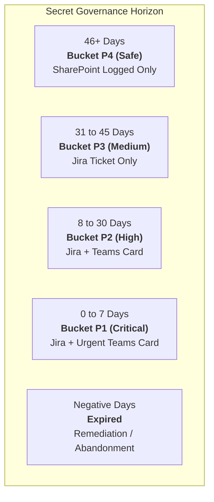
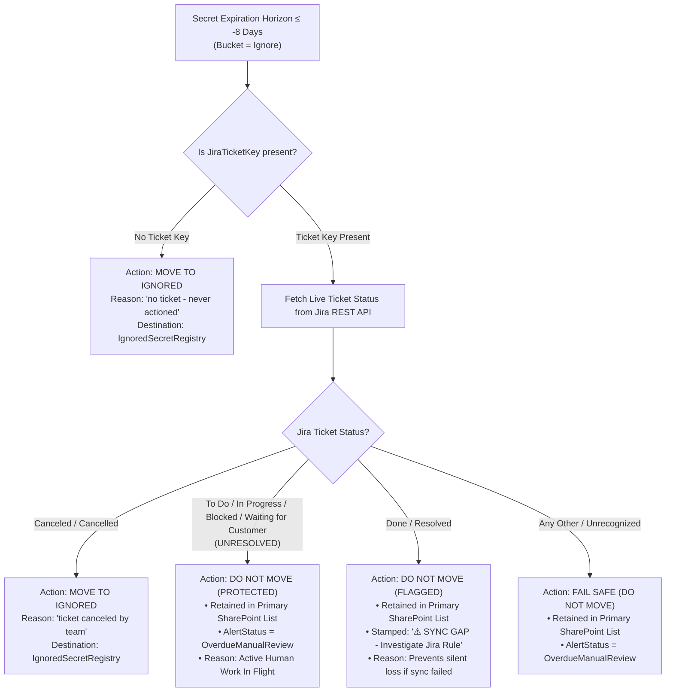

import { Callout } from 'nextra/components'

# Baseline (Old Solution) Upgrade & Client Implementation Guide

This guide is the complete operational and architectural specification for the **Baseline (Old Solution)** of the Azure Secret Governance system. It details **every single modification** made to the baseline engine, the exact rationale behind each decision, the precise code diffs, and the step-by-step instructions required for client teams to deploy and maintain these changes in their own environment.

<Callout type="info">
**Scope:** This document applies exclusively to the **Baseline Solution** (standard enterprise multi-tenant secret governance without pattern analysis). For the automated 1Password rotation engine and secondary tenant Jira bypass, see the [Pattern Analysis](/azure-secret-governance/pattern-analysis) section.
</Callout>

---

## 1. Executive Summary of Changes

The following table summarizes all baseline enhancements implemented across the codebase:

| # | Feature / Capability | Target Component | File Location | Business Outcome |
| :- | :--- | :--- | :--- | :--- |
| **1** | **Static Jira Summary** | Container 2 (`main.py`) | `container-2/main.py:756` | Eliminates stale days count from ticket title; prevents confusing Jira duplicates. |
| **2** | **Standard Description & Custom Field** | Container 2 (`main.py`) | `container-2/main.py:757-761` | Standardizes ticket layout and supports custom field mapping via `JIRA_DESCRIPTION_CUSTOM_FIELD_ID`. |
| **3** | **Jira Due Date Alignment** | Container 2 (`main.py`) | `container-2/main.py:759` | Automatically sets Jira issue `duedate` to match the exact secret expiration date (`YYYY-MM-DD`). |
| **4** | **45-Day Governance Lifecycle** | Decision Engine & Rotation Runbook | `decision_engine.py:159`<br/>`runbook_rotation.py:192,308` | Expands governance window from 30 to 45 days (P1: 0–7d, P2: 8–30d, P3: 31–45d, P4: 46+d Safe). |
| **5** | **Ignore List Indexing & De-Duplication** | Decision Engine | `decision_engine.py:1024-1041`<br/>`decision_engine.py:1338-1353` | Pre-checks `IgnoredSecretRegistry` before processing new secrets, completely stopping list bloat and duplicate rows. |
| **6** | **-8 Days Abandonment Rule** | Decision Engine | `decision_engine.py:1570-1706` | **Guarantees unresolved tickets are NOT moved to Ignore list**; only moves truly abandoned or canceled secrets while keeping active tickets visible as `OverdueManualReview`. |
| **7** | **TenantID Guard on PATCH Updates** | Container 2 (`main.py`) | `container-2/main.py:402-405` | Protects secondary tenant records from being overwritten to Primary Tenant during SharePoint PATCH updates. |
| **8** | **Jira Automation Rule 2 Webhook** | Jira Automation | Rule: *Sync ticket status to SharePoint* | Enables `"responseEnabled": true` ("Wait for response") to eliminate false-alarm Microsoft Teams failure alerts. |
| **9** | **Teams Alert Fatigue Suppression** | Decision Engine | `decision_engine.py:166-174,1714` | Sends Teams cards only for P1/P2; suppresses Teams cards for P3 (Jira-only) and P4 (Safe). |
| **10** | **Azure Automation Runtime** | Azure Runbooks | Azure Automation Account | Executes baseline runbooks inside custom `Python310-Custom` environment with pre-installed enterprise packages. |

---

## 2. Detailed Technical Specifications & Code Changes

### Change 1: Static Jira Ticket Summary

#### The Problem
Previously, the ticket summary was formatted dynamically with remaining days (e.g., `"[WARNING] Azure Secret Expiry - AppName (14 days remaining)"`). As time elapsed, the ticket title became stale (e.g., a ticket still showing "14 days remaining" when the secret had already expired). This confused application owners and broke search filters.

#### The Solution
The summary is now completely static, encoding only the severity level and application registration name:
```
[{severity}] Azure Secret Expiry - {app_name}
```

#### Exact Code Modification
* **File:** `container-2/main.py`
* **Function:** `create_jira_ticket()`
* **Line Number:** ~756

```python
# ==============================================================================
# BEFORE (Legacy dynamic title):
# ==============================================================================
summary_line = f"[{severity}] Azure Secret Expiry - {app_name} ({days_text})"

# ==============================================================================
# AFTER (Standardized static title):
# ==============================================================================
summary_line = f"[{severity}] Azure Secret Expiry - {app_name}"
```

---

### Change 2: Jira Description & Custom Field Support

#### The Problem
In customized Jira Service Management (JSM) and enterprise Jira Software projects, the default system `description` field is often hidden, restricted, or requires Jira REST API v3 Atlassian Document Format (ADF). Additionally, many client organizations capture description content inside a dedicated custom field (e.g., `customfield_10028`).

#### The Solution
Container 2 now constructs a structured multi-line plain text payload and conditionally injects it into both the system `description` field and an optional custom field defined by the environment variable `JIRA_DESCRIPTION_CUSTOM_FIELD_ID`.

#### Format Standard
```text
App Registration Name: {app_name}
App ID: {app_id}
Secret ID: {secret_id}
Secret Description: {secret_description}
Severity: {severity}
```

#### Exact Code Modification
* **File:** `container-2/main.py`
* **Function:** `create_jira_ticket()`
* **Line Numbers:** ~757–761

```python
# ==============================================================================
# AFTER (Standard description + custom field injection):
# ==============================================================================
text = (
    f"App Registration Name: {app_name}\n"
    f"App ID: {app_id}\n"
    f"Secret ID: {secret_id}\n"
    f"Secret Description: {secret_description}\n"
    f"Severity: {severity}\n"
)
if extra_note:
    text += f"\nNote: {extra_note}"

payload = {
    "fields": {
        "project": {"key": JIRA_PROJECT_KEY},
        "summary": summary_line,
        "description": text,
        "issuetype": {"name": JIRA_ISSUE_TYPE},
        "priority": {"name": priority},
        "labels": ["azure-secret", "rotation-required"],
        "duedate": expiration_date[:10]
    }
}

# Optional custom field support:
if JIRA_DESCRIPTION_CUSTOM_FIELD_ID:
    payload["fields"][JIRA_DESCRIPTION_CUSTOM_FIELD_ID] = text
```

#### Client Configuration
If your Jira project uses a custom field for description, set this environment variable in the Azure Container App (`container-2`):
```bash
JIRA_DESCRIPTION_CUSTOM_FIELD_ID="customfield_10028"
```
*(Leave blank or omit if your Jira project accepts the standard system `description` field).*

---

### Change 3: Jira Issue Due Date (`duedate`)

#### The Problem
Tickets were previously raised without an explicit Jira `duedate`, forcing engineering leads to manually calculate when a secret would expire or miss deadline escalations in Jira boards and dashboards.

#### The Solution
When creating the ticket, `create_jira_ticket()` extracts the date portion (`YYYY-MM-DD`) from `expiration_date` and populates the native Jira `duedate` field.

#### Exact Code Modification
* **File:** `container-2/main.py`
* **Line Number:** ~759

```python
# In payload["fields"]:
"duedate": expiration_date[:10]
```
*(E.g., if expiration date is `2026-11-14T08:30:00Z` or `2026-11-14 08:30:00 AM`, `duedate` is cleanly formatted as `"2026-11-14"`).*

---

### Change 4: 45-Day Governance Lifecycle Thresholds

#### The Problem
A 30-day window does not provide enough runway for complex enterprise environments where secret changes require cross-team coordination, change approval boards (CAB), and sprint backlog scheduling.

#### The Solution
The entire governance pipeline standardizes on a **45-day threshold** model:



#### Severity & Threshold Matrix

| Days Remaining | Bucket Name | Jira Ticket Created? | Jira Priority | Teams Notification? | Auto-Rotation Eligible? |
| :--- | :---: | :---: | :---: | :---: | :---: |
| **46+ Days** | **P4** | No | — | None (Safe) | No |
| **31 – 45 Days** | **P3** | **Yes** | `P3` / `Medium` | None (Suppressed) | **Yes** |
| **8 – 30 Days** | **P2** | **Yes** | `P2` / `High` | Warning Card Sent | **Yes** |
| **0 – 7 Days** | **P1** | **Yes** | `P1` / `Critical` | Urgent Card (@mention if 0–3d) | **Yes** |
| **-1 to -7 Days** | **ExpiredManualReview** | **Yes** | `P1` / `Critical` | Escalation Alert | No (Manual Review) |
| **-8 Days or more** | **Ignore** | Evaluated by Abandonment Rule | — | None | No (See Rule 6) |

#### Exact Code Modifications

##### 1. Decision Engine (`container-2/decision_engine.py`)
* **Line Numbers:** ~159–164

```python
def classify_bucket(days: int) -> str:
    """
    Classifies secret into priority buckets based on 45-day threshold model.
    """
    if days >= 46:       return "P4"
    if 31 <= days <= 45: return "P3"
    if 8  <= days <= 30: return "P2"
    if 0  <= days <= 7:  return "P1"
    if -7 <= days <= -1: return "ExpiredManualReview"
    return "Ignore"
```

##### 2. Rotation Runbook (`runbooks/devsecops-secret-governance-secret-rotation.py`)
* **Line Numbers:** ~191–192, 308–313, 838

```python
# Line 191-192:
ROTATION_ELIGIBLE_BUCKETS  = {"P1", "P2", "P3"}
DEFAULT_ROTATION_THRESHOLD = 45

# Line 308-313:
def _classify_bucket(days: int) -> str:
    if days >= 46:       return "P4"
    if 31 <= days <= 45: return "P3"
    if 8  <= days <= 30: return "P2"
    if 0  <= days <= 7:  return "P1"
    if -7 <= days <= -1: return "ExpiredManualReview"
    return "Ignore"

# Line 838:
run_secret_rotation(rotation_threshold_days=45)
```

---

### Change 5: Ignore List Indexing & De-Duplication

#### The Problem
In legacy versions, the monitoring decision engine checked only the primary SharePoint list (`SecretAlertRegistry` / `DevSecOps-SecretGovernance`) when identifying "new" secrets. Secrets previously moved to `IgnoredSecretRegistry` were absent from the primary list, causing the engine to classify them as "new" on every run and repeatedly append duplicate rows into the ignore list.

#### The Solution
The Decision Engine implements pre-indexing of all existing Secret IDs in `IgnoredSecretRegistry`:
1. **Pre-Filter New Candidates:** Before processing `new_secrets`, fetches all `SecretID` values currently in `IgnoredSecretRegistry` into a memory `set`.
2. **De-duplicate:** Any secret whose ID is already in `IgnoredSecretRegistry` is filtered out immediately.
3. **Pre-Check Expired Candidates:** Brand-new secrets that are already 8+ days expired check against this index before writing to `IgnoredSecretRegistry`.

#### Exact Code Modification
* **File:** `container-2/decision_engine.py`
* **Line Numbers:** ~1024–1041 & ~1338–1353

```python
# ==============================================================================
# PHASE 2: De-duplicate new candidates against IgnoredSecretRegistry
# ==============================================================================
if get_ignored_sharepoint_state is not None and new_secrets:
    try:
        ignored_state_for_dedup = await get_ignored_sharepoint_state()
        ignored_secret_ids = {
            item.get("fields", {}).get("SecretID", "")
            for item in ignored_state_for_dedup.get("items", [])
            if item.get("fields", {}).get("SecretID")
        }
    except Exception as e:
        summary["errors"].append(f"Could not read IgnoredSecretRegistry: {e}")
        ignored_secret_ids = set()

    if ignored_secret_ids:
        before_count = len(new_secrets)
        new_secrets = [c for c in new_secrets if c["secret_id"] not in ignored_secret_ids]
        summary["skippedAlreadyInIgnoredList"] = before_count - len(new_secrets)
```

---

### Change 6: The -8 Days Abandonment Rule & Unresolved Tickets Lifecycle

<Callout type="warning">
**Crucial Architectural Rule:** Does a row move to the Ignore list after -8 days if its Jira ticket is unresolved?
**Answer: ABSOLUTELY NOT.** The system strictly protects open, active remediation work.
</Callout>

#### The Business Logic & Decision Matrix
When a secret crosses into the "Ignore" bucket ($\le -8$ days past expiration), moving it to `IgnoredSecretRegistry` indiscriminately would yank an active incident or rotation out of view. 

The decision engine queries the live Jira ticket status to determine whether the secret is genuinely abandoned or under active investigation:



#### Detailed Breakdown of Status Outcomes

1. **Unresolved / In-Progress Tickets (`To Do`, `In Progress`, `Blocked`, `Waiting for Customer`):**
   * **Action:** **STAYS IN MASTER LIST.**
   * **`AlertStatus`:** Updated to `OverdueManualReview`.
   * **`ExpiryNotice`:** `"OVERDUE {days} days - ticket {jira_key} still '{status}', not auto-ignored, not auto-rotated, human review required"`.
   * **Rationale:** An engineer has an active ticket. Moving it to the ignore list would blindside the team, conceal an ongoing security vulnerability, and cause audit failure.

2. **No Jira Ticket at all (`jira_key` is blank):**
   * **Action:** **MOVED TO IGNORED LIST.**
   * **Destination:** `IgnoredSecretRegistry`.
   * **`IgnoreReason`:** `"Expired8Plus - no ticket - never actioned"`.
   * **Rationale:** The secret was never actioned and has been dead for more than a week.

3. **Canceled Tickets (`Canceled` / `Cancelled`):**
   * **Action:** **MOVED TO IGNORED LIST.**
   * **Destination:** `IgnoredSecretRegistry`.
   * **`IgnoreReason`:** `"Expired8Plus - ticket {jira_key} canceled"`.
   * **Rationale:** The application owner explicitly closed/canceled the ticket in Jira, confirming the secret is decommissioned or intentionally abandoned.

4. **Resolved Tickets Still Present (`Done` / `Resolved`):**
   * **Action:** **DO NOT MOVE.**
   * **Notice:** Flagged as `⚠ SYNC GAP`.
   * **Rationale:** If a ticket was marked Resolved in Jira, Jira Automation Rule 2 should have synced the SharePoint list to `Rotated`. Finding it still in the active list indicates the webhook failed. It is held in the master list so administrators can inspect the sync anomaly rather than silently sweeping it under the rug.

5. **Manual Admin Override in SharePoint:**
   * If an administrator manually changes `AlertStatus` in SharePoint to `"Ignored"`, the engine moves it to `IgnoredSecretRegistry` immediately on the next run, regardless of day count.

#### Exact Code Implementation
* **File:** `container-2/decision_engine.py`
* **Line Numbers:** ~1570–1708

```python
# ==============================================================================
# The -8-DAY ABANDONMENT CHECK (decision_engine.py)
# ==============================================================================
if not jira_key:
    move_reason = "no ticket - never actioned"
    should_move = True
    jira_status_for_note = "none"
else:
    issue = await get_jira_issue(jira_key)
    jira_status_for_note = (issue.get("status") or "").strip()
    status_lower = jira_status_for_note.lower()

    if status_lower in ("canceled", "cancelled"):
        move_reason = f"ticket {jira_key} canceled"
        should_move = True
    elif status_lower in ("done", "resolved"):
        # Flag sync gap, do NOT move
        should_move = False
        sync_gap_fields = {
            "LastChecked": today,
            "ExpiryNotice": f"⚠ SYNC GAP: Jira ticket {jira_key} is '{jira_status_for_note}' "
                            f"but row was never marked Rotated. Check Jira automation rule."
        }
        await write_sharepoint_row(item_id, sync_gap_fields)
        return result
    else:
        # UNRESOLVED: In Progress / To Do / Blocked / Waiting - FAIL SAFE, DO NOT MOVE
        should_move = False

if not should_move:
    overdue_fields = {
        "LastChecked": today,
        "AlertStatus": "OverdueManualReview",
        "ExpiryNotice": f"OVERDUE {abs(c['days'])} days - ticket {jira_key or '(none)'} "
                        f"still '{jira_status_for_note}', not auto-ignored, "
                        f"not auto-rotated, human review required",
    }
    await write_sharepoint_row(item_id, overdue_fields)
    return result

# Only moved if should_move == True (no ticket or canceled)
ignored_fields = {
    "Title":             c["app_id"],
    "AppName":           c["app_name"],
    "SecretID":          c["secret_id"],
    "SecretDescription": c["secret_desc"],
    "ExpirationDate":    c["expiration"],
    "DaysExpired":       abs(c["days"]),
    "TenantID":          c.get("tenant_id", ""),
    "LoggedDate":        today,
    "IgnoreReason":      f"Expired8Plus - {move_reason}",
    "JiraTicketKey":     jira_key,
    "AlertStatus":       "Ignored",
}
await move_secret_to_ignored(item_id, ignored_fields, move_reason)
```

---

### Change 7: TenantID Guard on SharePoint PATCH Updates

#### The Problem
In multi-tenant configurations (Tenant 1 and Tenant 2), when a Jira ticket transitions, Jira Automation triggers a webhook to `/api/jira/status-sync` (or `/jira-status-update`). When Container 2 updated the existing SharePoint item via HTTP `PATCH`, the helper function defaulted `fields["TenantID"] = GRAPH_TENANT_ID` (Tenant 1) if `TenantID` was not passed in the request body. This caused Tenant 2 rows to have their `TenantID` overwritten to Tenant 1!

#### The Solution
The helper functions (`write_sharepoint_row` / `create_or_update_sharepoint_item`) were updated with a strict condition:
* Only default `TenantID` to `GRAPH_TENANT_ID` when **creating a brand new item** (`item_id is None`) and no `TenantID` was supplied.
* On updates/PATCH (`item_id is not None`), **never overwrite `TenantID`**.

#### Exact Code Modification
* **File:** `container-2/main.py`
* **Line Numbers:** ~402–405

```python
# ==============================================================================
# BEFORE:
# ==============================================================================
if not fields.get("TenantID"):
    fields["TenantID"] = GRAPH_TENANT_ID

# ==============================================================================
# AFTER (TenantID protected on PATCH):
# ==============================================================================
# Only default TenantID to home tenant when creating a brand-new row (item_id is None).
# On updates/PATCH (item_id is not None), never touch TenantID unless explicitly passed.
if item_id is None and not fields.get("TenantID"):
    fields["TenantID"] = GRAPH_TENANT_ID
```

---

### Change 8: Jira Automation Rule 2 Webhook Configuration

#### The Problem
When Jira Automation Rule 2 (*Sync ticket status to SharePoint*) fired its webhook to Container 2, Jira checked `{{webhookResponse.status}}` to verify success. Because `"responseEnabled"` was set to `false` in the webhook action, Jira fired the request asynchronously and did not wait for the response. 

Consequently, `{{webhookResponse.status}}` was empty (`null`). When Jira evaluated the conditional rule `{{webhookResponse.status}} != 200`, the condition evaluated to `true`, triggering a false-alarm Microsoft Teams error message:
> *"Jira Automation failed to sync ticket KAN-XXXX to SharePoint: Status was when moving to Resolved"*

#### The Solution
In Jira Automation Rule 2, enable **"Wait for response"** (`"responseEnabled": true`). Container 2 processes the status sync and responds with `HTTP 200 OK` in ~150ms. Jira receives `webhookResponse.status == 200`, preventing the Teams error notification from ever firing.

#### Exact Configuration Steps in Jira Cloud UI
1. Navigate to **Project Settings** $\rightarrow$ **Automation**.
2. Select rule: **"Sync ticket status to SharePoint"**.
3. Click the **Send web request** action component.
4. Check the box: **"Wait for response"** (Sets `"responseEnabled": true`).
5. Ensure HTTP Method is `POST`, Content type is `Custom (application/json)`.
6. Save and publish the rule.

```json
{
  "type": "jira.issue.outgoing.webhook",
  "value": {
    "url": "https://<your-container-app-url>/jira-status-update",
    "method": "POST",
    "contentType": "custom",
    "responseEnabled": true,
    "continueOnErrorEnabled": false
  }
}
```

---

### Change 9: Microsoft Teams Alert Fatigue Suppression

#### The Problem
Sending Microsoft Teams card notifications for every secret expiring within 45 days overwhelmed engineering channels, resulting in engineers ignoring notifications.

#### The Solution
Teams notifications are strictly tiered:
* **P1 (0 to 7 days remaining):** Urgent Teams Adaptive Card sent. If $0 \le \text{days} \le 3$, `@mentions` application owners directly. If $4 \le \text{days} \le 7$, card is sent without `@mention`.
* **P2 (8 to 30 days remaining):** Standard warning Teams Adaptive Card sent (no `@mention`).
* **P3 (31 to 45 days remaining):** **Teams card is completely suppressed.** Jira ticket is raised, allowing teams to plan rotation during backlog grooming without chat interruptions.
* **P4 (46+ days remaining):** Neither Jira nor Teams notifications are generated.

#### Exact Code Modification
* **File:** `container-2/decision_engine.py`
* **Line Numbers:** ~166–174, ~1714

```python
def should_tag_p1(days: int) -> bool:
    """Only 0-3 days tags individuals; 4-7 days alerts without personal tagging."""
    return 0 <= days <= 3

# In process_secret_candidates():
# P1 and P2 trigger Teams card:
if bucket in ("P1", "P2"):
    await send_teams_alert(...)
# P3 skips Teams alert:
elif bucket == "P3":
    log.info(f"App {app_name} in bucket P3 (31-45d): Jira ticket created, Teams alert suppressed.")
```

---

### Change 10: Azure Automation Runbooks & Custom Runtime

#### The Problem
The default Azure Automation Python 3.8/3.10 sandbox lacks critical modern cryptographic and cloud identity libraries, causing runbook failures (`ModuleNotFoundError: No module named 'msal'`).

#### The Solution
Configure a Custom Runtime Environment in Azure Automation:
* **Runtime Name:** `Python310-Custom`
* **Language:** Python 3.10
* **Required Packages:**
  * `msal` (v1.28.0+)
  * `requests` (v2.31.0+)
  * `azure-identity` (v1.16.0+)
  * `azure-keyvault-secrets` (v4.8.0+)
* **Runbook Deployment:**
  Both `runbook_monitoring.py` and `devsecops-secret-governance-secret-rotation.py` are bound to `Python310-Custom`.

---

## 3. Client Deployment & Verification Checklist

Follow this checklist to verify that your environment is fully compliant with the Baseline specification:

```markdown
### Pre-Deployment Verification
- [ ] 1. container-2/main.py: Verify `summary_line = f"[{severity}] Azure Secret Expiry - {app_name}"`.
- [ ] 2. container-2/main.py: Verify `duedate` is set to `expiration_date[:10]` in ticket fields.
- [ ] 3. container-2/main.py: Verify `JIRA_DESCRIPTION_CUSTOM_FIELD_ID` environment variable support.
- [ ] 4. container-2/main.py: Verify `TenantID` is only assigned when `item_id is None`.
- [ ] 5. container-2/decision_engine.py: Verify `classify_bucket()` uses 45-day thresholds (P1: 0-7, P2: 8-30, P3: 31-45, P4: 46+).
- [ ] 6. container-2/decision_engine.py: Verify `ignored_secret_ids` pre-indexing de-duplicates new secrets.
- [ ] 7. container-2/decision_engine.py: Verify -8 days abandonment rule keeps unresolved tickets in Master List as `OverdueManualReview`.
- [ ] 8. runbook_rotation.py: Verify `DEFAULT_ROTATION_THRESHOLD = 45` and `ROTATION_ELIGIBLE_BUCKETS = {"P1", "P2", "P3"}`.
- [ ] 9. Jira Automation: Verify Rule 2 ("Sync ticket status to SharePoint") has "Wait for response" (`responseEnabled: true`) checked.
- [ ] 10. Azure Automation: Verify runbooks are set to run in `Python310-Custom`.

### Post-Deployment Operational Verification
- [ ] Execute test secret creation with 3d (P1), 15d (P2), 38d (P3), and 100d (P4).
- [ ] Run monitoring runbook: confirm 3 Jira tickets created (P1, P2, P3) and 0 tickets for P4.
- [ ] Confirm Teams cards sent for P1 and P2 only; P3 is Jira-only.
- [ ] Confirm Jira ticket summary is static and duedate matches secret expiry.
- [ ] Confirm SharePoint Master List records all 4 rows with accurate TenantID values.
- [ ] Confirm unresolved tickets past -8 days stay in Master List as `OverdueManualReview`.
```
