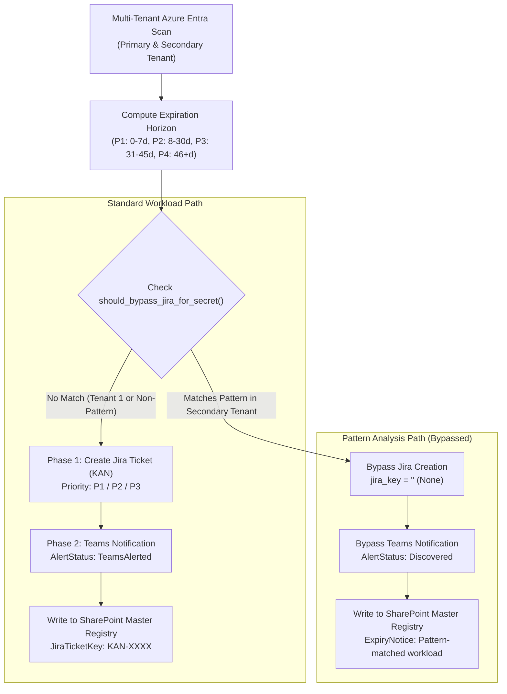

import { Callout } from 'nextra/components'

# Pattern Analysis Decision Engine (Container 2)

This directory contains the production-deployed **Pattern Analysis Decision Engine** code for **Container 2** (`monitor-mcp` microservice).

While standard enterprise workloads follow the standard alert lifecycle (Jira tickets, Teams notifications, manual intake), **automated secondary tenant microservices** matching specific naming patterns bypass human ticketing and alerting to prevent notification fatigue and ticket backlog.

---

## Architecture: Standard vs. Pattern-Matched Workloads

---

## Strict Two-Condition Bypass Rule

To guarantee enterprise compliance and prevent accidental alert suppression, a secret candidate **MUST** satisfy **BOTH** conditions to be bypassed:

1. **Rule 1: Strict Secondary Tenant Scoping**
   * The secret **MUST** originate from the designated Secondary Tenant (`c721d616-dcf3-4510-9c3e-548bc6c1f628`).
   * Primary Tenant secrets (`70afdd80-5f5b-4a09-a90d-383f126e8c33`) are **NEVER** bypassed, regardless of their description or name.

2. **Rule 2: Naming Pattern Match**
   * The secret description or display name must match one of the configured glob/substring patterns:
     * `*.select*` (e.g. `auth.select.credential`)
     * `practice-plus-*` (e.g. `practice-plus-worker-key`)
     * `*partner*` (e.g. `partner-gateway-secret`)

---

## Environment Variable Configuration (Fail-Safe Default)

The bypass mechanism is strictly driven by Azure Container App environment variables. To prevent production issues or accidental alert suppression, **there are no hardcoded default bypass lists in the code**:

| Environment Variable | Description | Value Example | Missing / Unset Behavior |
| :--- | :--- | :--- | :--- |
| `BYPASS_JIRA_PATTERNS` | Comma-separated list of glob/substring patterns to bypass | `*.select*,practice-plus-*,*partner*` | **Bypass Disabled** (No patterns match) |
| `BYPASS_JIRA_TENANT_IDS` | Comma-separated list of Entra tenant IDs where bypass applies | `c721d616-dcf3-4510-9c3e-548bc6c1f628` | **Bypass Disabled** (No tenants match) |

<Callout type="warning">
  **Fail-Safe Design:** If either `BYPASS_JIRA_PATTERNS` or `BYPASS_JIRA_TENANT_IDS` is unset or empty, the Decision Engine automatically defaults to `False` (zero bypasses). All expiring secrets will follow standard Jira ticket creation and Teams alert lifecycles.
</Callout>

---

## Live End-to-End Test Verification

The pattern analysis implementation was verified live against Azure production infrastructure:

* **Execution Trigger**: Azure Automation Runbook `secret-monitoring` (`secret-rotation-sentinel` in resource group `Foundry-Project`).
* **Container Endpoint**: `https://secret-governance-v2.ambitiousbay-f708bc7b.southindia.azurecontainerapps.io/run`
* **Test Apps Evaluated**:
  1. `Test-Pattern-App-Select-Live` (`auth.select.credential`) &rarr; **Bypassed**: Logged in SharePoint as `AlertStatus: Discovered`, `JiraTicketKey: None`, 0 Teams alerts, 0 Jira tickets.
  2. `Test-Standard-App-Gateway-Live` (`standard-gateway-secret`) &rarr; **Standard**: Ticket `KAN-3364` created, Teams alert sent, logged as `AlertStatus: TeamsAlerted`.
* **SharePoint List Count**: Verified delta from `1,294` &rarr; `1,296` items (+2 items logged).
* **Jira Ticket Count**: Verified delta from `233` &rarr; `236` issues (Standard app ticket `KAN-3364` created; pattern app ticket completely bypassed).

---

## Files in this Section

* [`decision_engine.py`](/azure-secret-governance/source-code/pattern-analysis/decision-engine): Full production Decision Engine source code.
